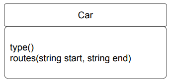
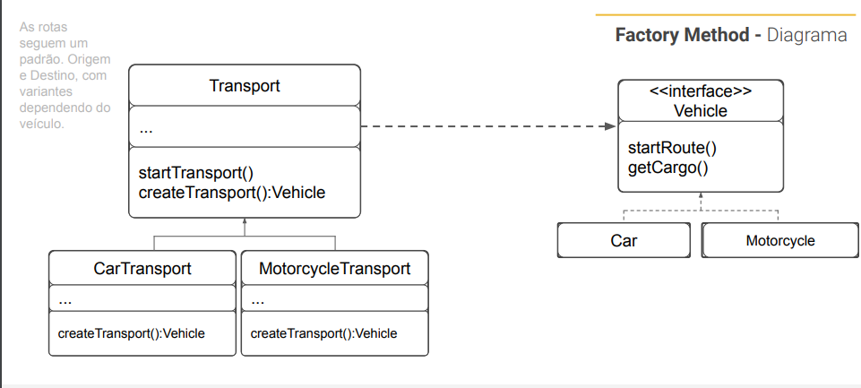

<div align="center">
    <h1>Creational - Design Pattern</h1>
    <h2>Factory Method</h2>
</div>

## PROBLEM
Toda a aplicação foi pensada em carros talvez até com uma variação
como o Uber Black, porém agora você tem uma demanda da área de
Negócios, o Uber Eats, e em vez de apenas carros temos motos. E ainda,
em grandes cidades, temos bicicletas também.
Se a maior parte da aplicação está em amarrada a uma classe ou de
alguma forma está engessada, fica complicado estender os recursos para
aplicar a outros meios de transporte e suas nuances, por exemplo bicicleta,
não tem porta malas para diferenciar a categoria.
Resultado: Código sujo, if e demais condicionais com efeitos colaterais e
difícil manutenibilidade. 
<div align="center"><br/></div>

## SOLUTION
Neste padrão, você deve substituir as chamadas diretas (new) de construção de objetos da classe,
para um método intermediário que fará o papel de fábrica, este método fábrica ou Factory Method,
irá controlar como criar os objetos que estendem a sua classe serão instanciados.
Os objetos retornados pelo método fábrica são chamados de produtos ou Classes Concretas.
Assim temos em nosso cenário a classe Veículo que implementa a interface Transporte, e as
subclasses concretas carros, motos, bicicletas que herdam de Veículo e implementar os métodos
declarados na interface.
A limitação fica por conta das subclasses. Caso estas retornem valores diferentes, precisam
compartilhar a mesma classe ou interface base. O método fábrica ou Factory Method na classe
base deve ter a Interface como o seu tipo de retorno.

## DIAGRAM


## HOW TO RUN 
```bash
   npm run dev -- --uber # to execute the Uber with passenger
   npm run dev -- --log # to execute the Uber with delivery order
   npm run dev -- --eats # to execute the Uber with delivery eats
```
# 