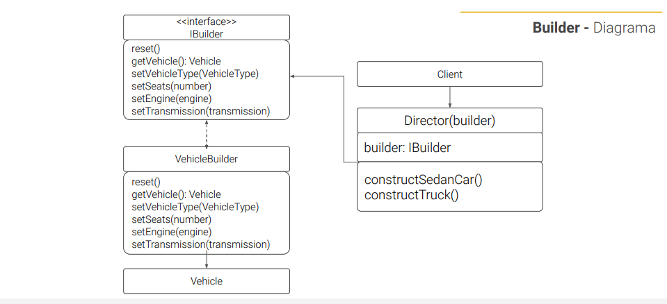

<div align="center">
    <h1>CREATIONAL - Design Pattern</h1>
    <h2>BUILDER</h2>
</div>

## PROBLEM
Quando criamos um objeto com muitas regras de negócio, métodos, é sempre um
risco termos construtores com inúmeros parâmetros. Este é um problema, uma vez
que situações que não precisem de tantos parâmetros podem fazer uma série de
parâmetros null, ou vazio. Na verdade métodos que passam de 3 a 4 parâmetros
podem confundir a clareza do código e se enquadra no que é chamado de Long
Parameter List.

Para ilustrar imagine o objeto o **Carro**. Para construir um carro, você precisa de motor,
carroceria, rodas, combustível. Mas e se você quiser uma caminhonete? ou um
caminhão?

Talvez você pense em herança, estender a classe **Carro** e criar um conjunto de
subclasses para cobrir todas as possibilidades. Isso poderá resultar em um número
considerável de subclasses além de engessar essas subclasses, se precisar de uma
caminhonete 4x4 o processo irá se repetir, estender novamente e assim por diante.

É aí que o padrão Builder, irá nos ajudar.

## SOLUTION
No padrão Builder iremos quebrar o processo de criação do objeto em etapas, e em
vários métodos, como ferramentas e componentes, preciso de motor, ok a classe
Motor estará disponível, preciso de uma caçamba afinal estamos fazendo uma
caminhonete, temos o Componente Caçamba que está a nossa disposição.

Esses componentes serão chamados builders, que são os itens para construir o objeto
complexo.

A sequência da construção, será guiada por um Diretor, que recebe quais os métodos
ele precisa, e sempre que solicitado, dispara a sequência para os builders, que irão
construir o objeto.

Assim, temos uma biblioteca de componentes e ferramentas, que são acessadas pelo
diretor quando provocado a construir algum modelo pré-estabelecido por meio de uma
interface.

## DIAGRAM


## HOW TO RUN 
```bash
   npm run dev    
```
# 