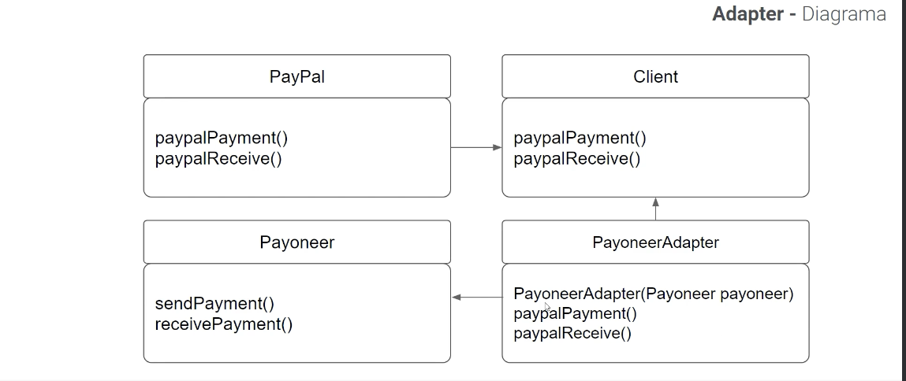

<div align="center">
    <h1>STRUCTURAL - Design Pattern</h1>
    <h2>Adapter</h2>
</div>

## PROBLEM
Imagine por exemplo que temos que integrar um sistema de pagamentos,
todo o sistema foi pensado no **PayPal**, os métodos estão todos de acordo
com PayPal, porém agora nós queremos implementar um novo módulo do
sistema utilizando a API que já funciona, e este novo módulo será os
pagamentos por meio da **Payoneer**, o problema é que os métodos
possuem nomes diferentes, estruturas diferentes.
Agora precisamos adaptar o nosso cliente para consumir tanto do PayPal
quando do Payoneer, só que... não pode quebrar o que já está funcionando.

## SOLUTION
Podemos utilizar o padrão ADAPTER para **converter a interface de um objeto** de
maneira que **outro objeto possa compreender as informações.** É um adaptador.

Um adaptador encobre um dos objetos para esconder as regras de negócio e
qualquer dificuldade da conversão, isso fica oculto. O objeto encoberto neste
caso o PayPal nem fica sabendo que existe um adapter, o adapter só consome a
informação.

Adapter: Converte a interface de uma classe para outra interface que o código
cliente espera encontrar. A entidade adaptadora permite que classes com
interfaces incompatíveis trabalhem juntas.

## DIAGRAM


## HOW TO RUN 
```bash
   npm run dev    
```
# 