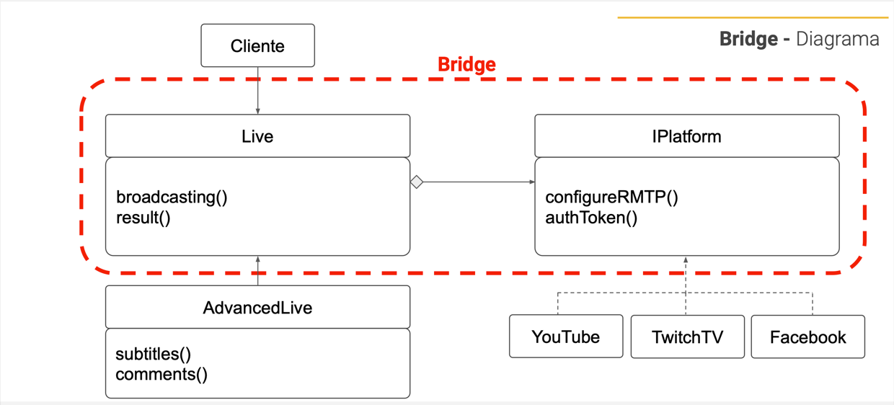

<div align="center">
    <h1>STRUCTURAL - Design Pattern</h1>
    <h2>BRIDGE</h2>
</div>

## PROBLEM
você precisa desenvolver um sistema de transmissão de lives, eventos ao vivo pela internet.  

Mas em vez de conectar somente ao **YouTube**, será necessário que a mesma live seja transmitida na **Twitch** e no **Facebook**.
Neste momento temos um problems, afinal as três plataformas trabalham com os mesmos padrões, porém cada uma com
sua especificação.

Podemos criar uma classe enorme com todos os requisitos das três plataformas, mas a essa altura do curso
você ja percebeu que isso fere uma série de princípios, e engessa o código.

Todas as plataformas precisam de uma transmissão, conexão, configuração, streaming, endereço IP, então como podemos
separar a plataforma do conceito da live, e escalar isso para qualquer quantidade de plataformas ?


## SOLUTION
Precisamos quebrar essa classe em várias classes, mas pense bem, Youtube Live, Facebook Live e TwitchTV Live,
ou seja todas as plataformas utilizam o mesmo conceito.

Então como podemos quebrar uma classe grande em várias? E ainda assim compartilhar os recursos de transmissão
como configuração RMTP, autenticação e outros métodos necessários para fazer a Live?

O Bridge é um padrão de projeto estrutural que permite que você divida uma classe grande ou um conjunto de classes
intimamente ligadas em duas hierarquias separadas. 

## DIAGRAM


## HOW TO RUN 
```bash
   npm run dev    
```
# 