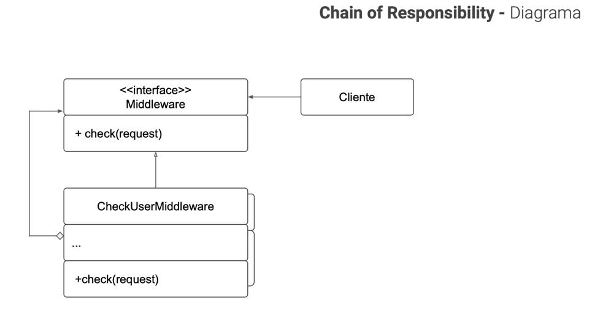

<div align="center">
    <h1>BEHAVIORAL - Design Pattern</h1>
    <h2>Chain of Responsibility</h2>
</div>

## PROBLEM
A aplicação pode tentar autenticar um usuário ao sistema sempre que
receber um pedido que contém as credenciais do usuário. Contudo, se
essas credenciais não estiverem corretas e a autenticação falhar, não
há razão para continuar com outras checagens.

Com o tempo você implementa mais diversas checagens sequenciais.

## SOLUTION
Como muitos outros padrões de projeto comportamental.

Chain of Responsibility se baseia na ideia de transformar comportamentos em objetos
independentes denominados handlers.

Assim as verificações são extráidas para sua própria classe com o union
método que faz a checagem. O pedido, junto com seus dados, é passado para esse
método como um argumento.

O padrão sugere que os handlers sejam ligados como em uma corrente.

Cada handler ligado tem um campo para armazenar uma referência ao
próximo handler da corrente. Além de processar o pedido, os handlers
também o passam adiante na corrente.

O pedido viaja através da corrente até que todos os handlers tiveram uma
chance de processá-lo.

E aqui está a melhor parte: um handler pode decidir não passar o pedido
adiante na corrente e efetivamente interromper um próximo
processamento.

## DIAGRAM


## HOW TO RUN 
```bash
   npm run dev    
```
# 